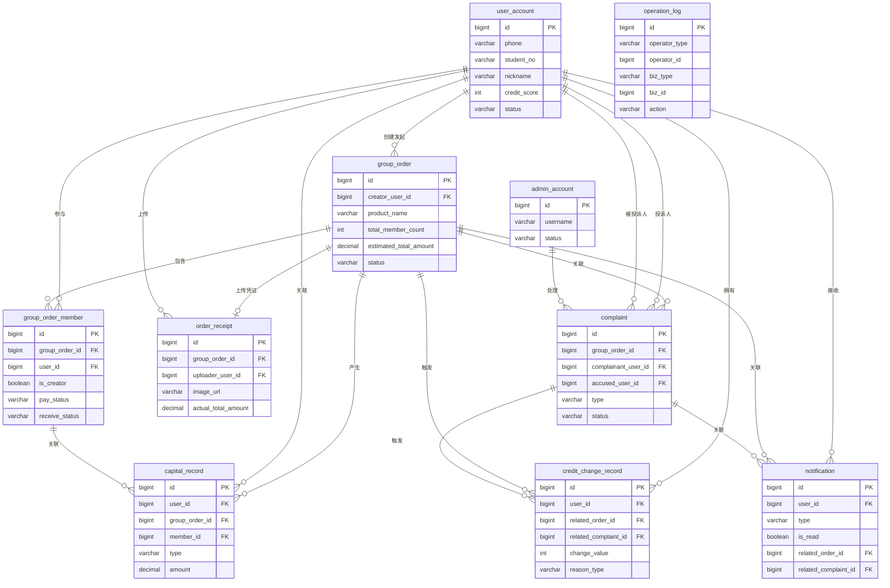

```mermaid
erDiagram
    user_account {
        bigint id PK
        varchar phone
        varchar student_no
        varchar nickname
        int credit_score
        varchar status
    }

    admin_account {
        bigint id PK
        varchar username
        varchar status
    }

    group_order {
        bigint id PK
        bigint creator_user_id FK
        varchar product_name
        int total_member_count
        decimal estimated_total_amount
        varchar status
    }

    group_order_member {
        bigint id PK
        bigint group_order_id FK
        bigint user_id FK
        boolean is_creator
        varchar pay_status
        varchar receive_status
    }

    order_receipt {
        bigint id PK
        bigint group_order_id FK
        bigint uploader_user_id FK
        varchar image_url
        decimal actual_total_amount
    }

    complaint {
        bigint id PK
        bigint group_order_id FK
        bigint complainant_user_id FK
        bigint accused_user_id FK
        varchar type
        varchar status
    }

    capital_record {
        bigint id PK
        bigint user_id FK
        bigint group_order_id FK
        bigint member_id FK
        varchar type
        decimal amount
    }

    credit_change_record {
        bigint id PK
        bigint user_id FK
        bigint related_order_id FK
        bigint related_complaint_id FK
        int change_value
        varchar reason_type
    }

    notification {
        bigint id PK
        bigint user_id FK
        varchar type
        boolean is_read
        bigint related_order_id FK
        bigint related_complaint_id FK
    }

    operation_log {
        bigint id PK
        varchar operator_type
        bigint operator_id
        varchar biz_type
        bigint biz_id
        varchar action
    }

    user_account ||--o{ group_order : "创建发起"
    user_account ||--o{ group_order_member : "参与"
    group_order ||--o{ group_order_member : "包含"
    group_order ||--o| order_receipt : "上传凭证"
    user_account ||--o{ order_receipt : "上传"
    group_order ||--o{ complaint : "关联"
    user_account ||--o{ complaint : "投诉人"
    user_account ||--o{ complaint : "被投诉人"
    user_account ||--o{ credit_change_record : "拥有"
    group_order ||--o{ credit_change_record : "触发"
    complaint ||--o{ credit_change_record : "触发"
    group_order ||--o{ capital_record : "产生"
    user_account ||--o{ capital_record : "关联"
    group_order_member ||--o{ capital_record : "关联"
    user_account ||--o{ notification : "接收"
    group_order ||--o{ notification : "关联"
    complaint ||--o{ notification : "关联"
    admin_account ||--o{ complaint : "处理"
```

**图 X-X 校园拼单平台数据库 ER 图**

**图注：**
本图展示校园拼单平台核心数据实体之间的关系结构。系统以用户、拼单主表和拼单成员表为中心，通过订单凭证、投诉、资金流水、信用分变更、通知和操作日志等实体支撑拼单流程、异常处理和后台审计。ER 图中的实体关系与系统数据库设计、业务流程和后续程序实现保持一致。
