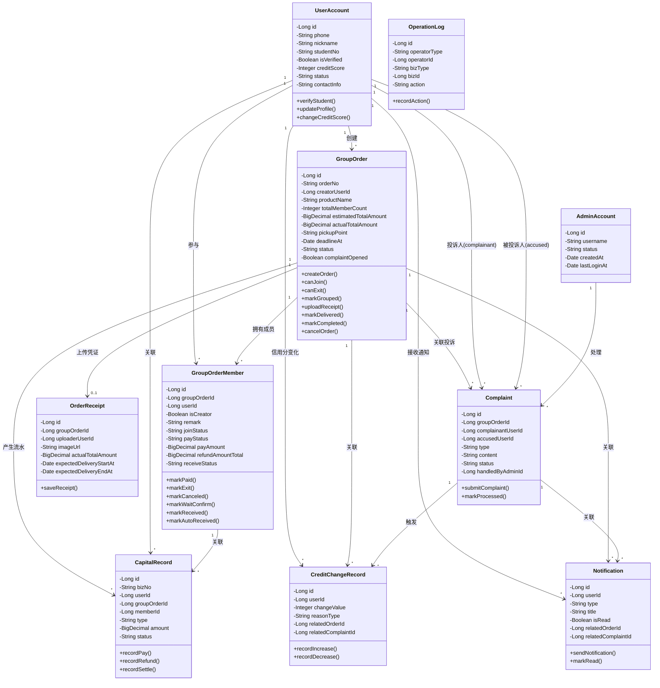

**图 X-X 校园拼单平台核心实体类图**

**图注：**
本图展示校园拼单平台的核心实体类及其静态关系。系统以 GroupOrder 和 GroupOrderMember 为中心，通过 UserAccount、OrderReceipt、Complaint、CapitalRecord、CreditChangeRecord、Notification 和 OperationLog 等实体共同支撑拼单主流程、异常投诉处理和后台审计功能。
