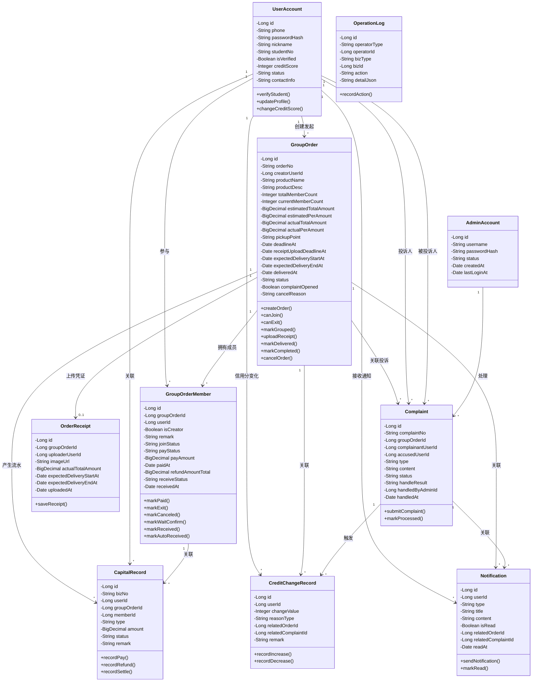

**图 X-X 校园拼单平台核心实体类图**

**图注：**
本图展示校园拼单平台的核心实体类及其静态关系。系统以 GroupOrder 和 GroupOrderMember 为中心，通过 UserAccount、OrderReceipt、Complaint、CapitalRecord、CreditChangeRecord、Notification 和 OperationLog 等实体共同支撑拼单主流程、异常投诉处理和后台审计功能。实体类设计与需求文档 v6.2 保持一致，涵盖用户管理、拼单全流程、伪支付伪退款、信用分体系和投诉处理等核心业务。

**核心业务规则说明：**
1. **信用分规则**：初始80分，完成有效拼单+2分，投诉成立-10分，主动放鸽子-15分，发起人未上传凭证-10分
2. **拼单状态**：拼单中、已成团、待送达、待收货、已完成、已取消
3. **用户-拼单状态**：待支付、已支付、待收货、已收货、已退款
4. **投诉类型**：仅支持"发起人未购买商品"和"发起人上传虚假凭证"两类
5. **投诉状态**：待处理、已处理
6. **支付机制**：平台代收代付，采用伪支付伪退款，不涉及真实资金流转
7. **交付机制**：发起人上传凭证后填写实际总金额和预计送达时间区间，确认送达后参与者30分钟内需确认收货，超时自动确认
