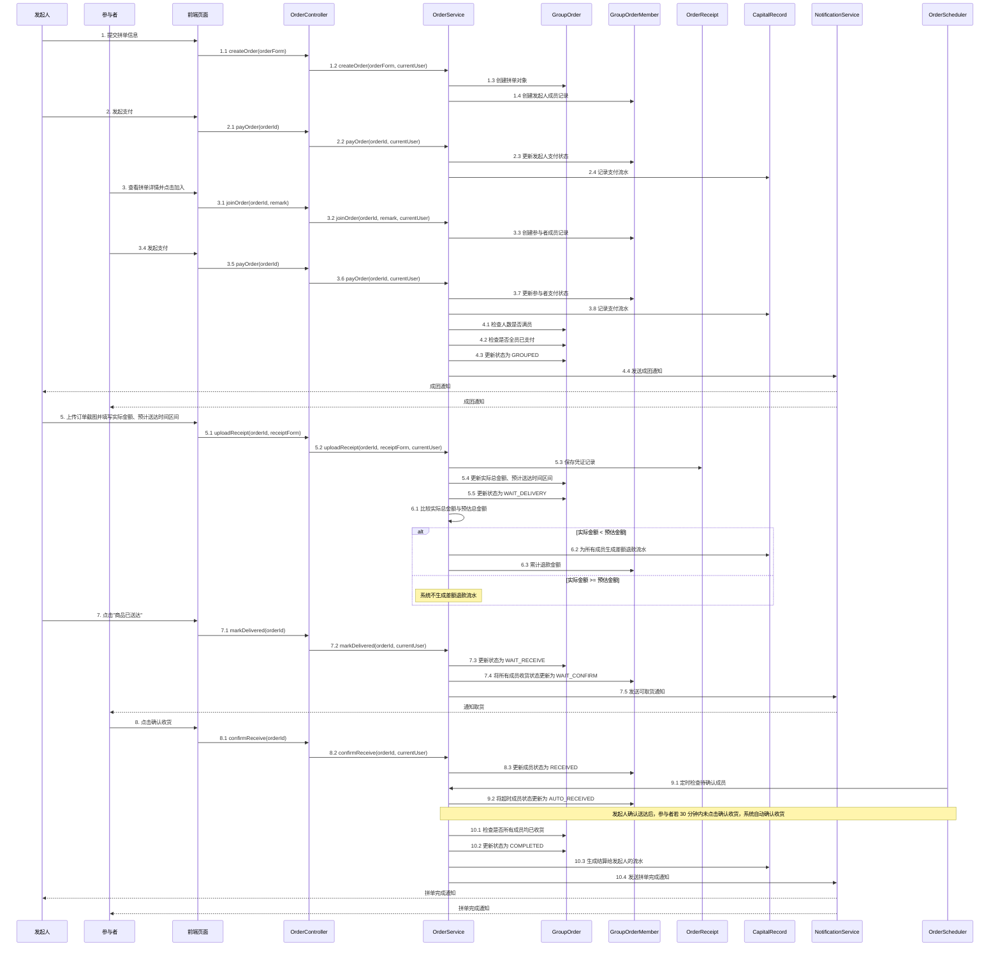

**图 X-X 拼单主流程协作图**

**图注：**
本图展示拼单主流程中参与者、前端页面、控制类、服务类和核心实体之间的通信关系与职责分工。主要流程包括：发起人创建拼单、参与者加入并支付、系统自动成团、发起人上传凭证、系统执行差额退款、发起人确认送达、参与者确认收货、系统自动确认收货、以及完成拼单与结算等关键环节。

**关键业务规则说明：**
1. 发起人发布拼单后自动加入成员列表
2. 发起人也必须完成支付
3. 参与者加入后需要支付才真正占用名额
4. 只有当人数满员且所有参与者都已支付时，拼单才会进入 GROUPED 状态
5. 成团后系统向所有成员发送通知
6. 拼单成团后，发起人必须上传订单凭证
7. 若实际金额低于预估金额，系统自动退差额
8. 发起人确认送达后，拼单转为 WAIT_RECEIVE
9. 参与者确认收货后更新状态
10. 超时 30 分钟未确认的成员由系统自动确认
11. 所有成员都收货后，拼单进入 COMPLETED
12. 拼单完成后系统生成对发起人的结算流水
