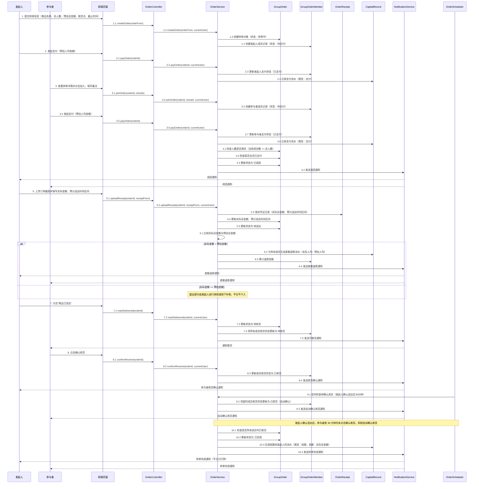

**图 X-X 拼单主流程协作图**

**图注：**
本图展示拼单主流程中参与者、前端页面、控制类、服务类和核心实体之间的通信关系与职责分工。主要流程包括：发起人创建拼单、参与者加入并支付、系统自动成团、发起人上传凭证、系统执行差额退款、发起人确认送达、参与者确认收货、系统自动确认收货、以及完成拼单与结算等关键环节。协作图设计严格遵循需求文档 v6.2 的业务规则和状态定义。

**关键业务规则说明：**
1. **发起人发布拼单**：系统自动将发起人加入成员列表，发起人需完成支付（预估人均金额）
2. **参与者加入**：填写备注并完成支付，支付成功后占用拼单名额
3. **自动成团条件**：人数满员（当前成员数 >= 总人数）且所有参与者均已完成支付
4. **凭证上传要求**：成团后30分钟内必须上传订单截图、填写实际总金额和预计送达时间区间
5. **差额退款规则**：若实际金额 < 预估金额，系统自动退差额（预估人均 - 实际人均）；若实际金额 >= 预估金额，超出部分由发起人自行承担
6. **确认送达触发**：商品实际送达取货点后，发起人点击"商品已送达"，系统通知所有参与者可取货，并开启30分钟确认收货倒计时
7. **确认收货方式**：参与者主动确认收货或系统30分钟自动确认
8. **拼单完成条件**：所有参与者均已确认收货（含系统自动确认）
9. **平台结算**：所有参与者确认收货后，系统自动将实际总金额打款给发起人
10. **状态定义**：拼单状态包括 拼单中、已成团、待送达、待收货、已完成、已取消

**对象职责分工：**
- **发起人**：填写拼单信息、支付、上传凭证、确认送达
- **参与者**：查看拼单、填写备注加入、支付、确认收货
- **前端页面**：负责交互和请求发起
- **OrderController**：负责接口入口和请求转发
- **OrderService**：负责主业务流程控制和状态管理
- **GroupOrder**：负责拼单主状态承载和业务规则验证
- **GroupOrderMember**：负责成员状态承载（加入、支付、收货状态）
- **OrderReceipt**：负责凭证信息存储
- **CapitalRecord**：负责资金流水记录（支付、退款、结算）
- **NotificationService**：负责通知发送（成团、退款、送达、完成）
- **OrderScheduler**：负责自动化任务执行（超时检测、自动确认收货）
